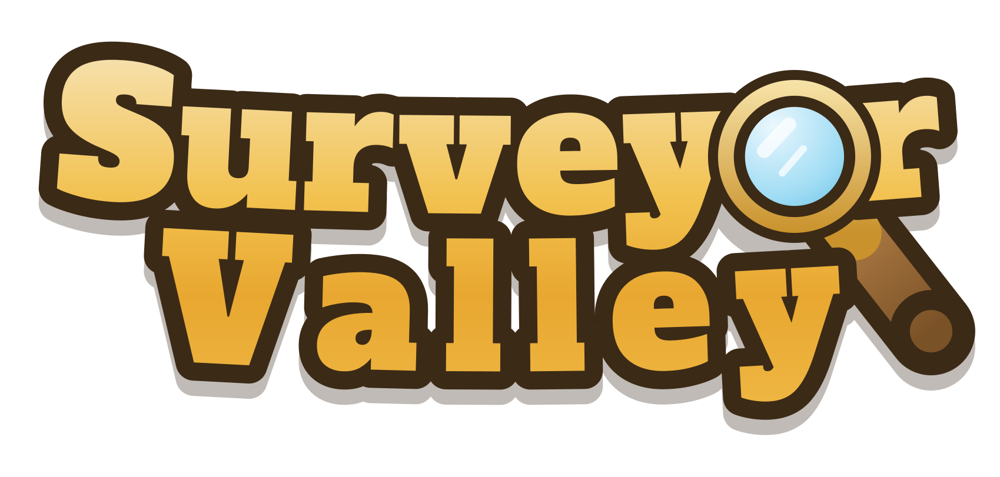

<p align="center">
  
</p>

<p align="center">
  <strong>Um jogo didático de topografia — levantamento planimétrico com estação total.</strong><br>
  <em>A teaching game about land surveying: planimetry with a total station.</em>
</p>

<p align="center">
  <a href="https://kauevestena.github.io/surveyor_valley/"><strong>▶ Jogar agora · Play now</strong></a>
</p>

---

## What it is

You are the surveyor of a valley with six rural properties in it, and the owners are
waiting. For each job you walk the ground, plant monuments where a tripod can actually
stand, set the instrument up over one and orient it on another, send your assistant out
with the prism, sight every boundary corner, close a traverse, compensate it, and deliver
a **planta** and a **memorial descritivo**. Then you walk to the farmhouse, where the
owner pays you, and you spend it on a better instrument.

Everything the game asks of you is what a first-year Topografia course asks: **planimetry
only** — no GNSS, no levelling, no altimetry. The angles, distances, azimuths, closure and
area are computed the way they are computed by hand, and the game will show you its
working at every step.

It runs entirely in the browser. No install, no back end, no account.

### Em português

Você está num vale com propriedades rurais a serem medidas. Seis propriedades rurais precisam de levantamento
planimétrico: implante os marcos, instale a estação total, oriente pela ré, vise os
vértices, feche e compense a poligonal e entregue a planta e o memorial descritivo. O dono
da propriedade paga na sede, e o dinheiro compra equipamento melhor.

O jogo é bilíngue e começa em português. **Simulação didática — os documentos gerados não
têm valor legal.**

## Playing

| | |
| --- | --- |
| **Walk** | `W A S D` or the arrow keys · `Shift` to run · a thumbstick on a touchscreen |
| **Tools** | `1`–`7` for the rail down the left-hand side · `M` for the map |
| **Plant a marco** | `Space` puts one at your feet; click firm ground further off and Ligeirinho runs out and plants it there |
| **Aim** | click a corner — he carries the prism to it, and the reading lands when he arrives |
| **Measure everything in view** | `B`, on fácil only |
| **Travel** | double-click a monument to walk there at a realistic pace, with the clock charged for it |
| **Look around** | right-drag, or two fingers · the wheel, `Z`/`X`, or a pinch to zoom |
| **Cancel** | `Esc` |

Three difficulties: **fácil** is unhurried and lets you measure everything in view from one
setup; **médio** buries a share of the boundary marks in scrub, so you have to find them on
foot; **difícil** adds a clock and demands 1:2000.

A world is completely described by its seed, so a link can carry one — handy for setting a
whole class the same valley:

```
https://kauevestena.github.io/surveyor_valley/?seed=sv-3a9197&difficulty=facil&lang=en&start=1
```

## Running it locally

```bash
git clone https://github.com/kauevestena/surveyor_valley.git
cd surveyor_valley
python3 -m http.server 8080     # or `npx serve .`
# then open http://localhost:8080/
```

**Opening `index.html` from the file system will not work.** The game is built from ES
modules, which browsers refuse to load over `file://`. Any static server will do.

**The first load needs a network**, for PixiJS — pinned to an exact version with an SRI
hash and pulled from a CDN. A service worker then caches it along with every file of the
game, so every visit after the first works completely offline, which is the case that
matters in a classroom. For an air-gapped lab, drop the Pixi bundle at
`vendor/pixi.min.mjs` and `src/render/pixi.js` will prefer it with no other change.

## Tests

```bash
node --test            # 243 of them, no install, no dependencies
```

Node 20 runs ESM and ships a test runner, and everything under `src/core/`, `src/survey/`,
`src/world/` and `src/game/` is free of the DOM — which is why `tests/pipeline.test.mjs`
can drive an entire survey, from the first monument to the finished memorial descritivo,
without a browser.

## How it is laid out

```
index.html          the game; every path below it is relative
sw.js               the offline cache — add a file, add it here
src/
  core/             seeded RNG, noise, the fixed-step loop, save format
  world/            terrain, the parcel partition, scatter, spatial index, line of sight
  survey/           the actual surveying: angles, reductions, traverse, adjustment
  game/             rules — tools, the crew, the economy, what a service is
  render/           Pixi scene, sprite painters, the overlay instrumentation
  report/           planta, memorial descritivo, PDF
  ui/               HUD, modals, panels, i18n
tests/              node --test, DOM-free
assets/             the logo, in both of its forms
tools/              the scripts that draw the logo
docs/
  design-notes.md   why it is built this way — the interesting document
  descricao-original.md   the original brief, in Portuguese
```

The parcels are cut, not drawn: a weighted Voronoi partition of one block, with the shared
edges irregularised once on the shared edge object, so two neighbours receive the identical
vertex chain and a marco planted on the line genuinely serves both. Most of the design is
like that, and [`docs/design-notes.md`](docs/design-notes.md) is where it is written down.

## Credits

- **[PixiJS](https://pixijs.com/)** — the renderer, MIT.
- **[Alfa Slab One](https://fonts.google.com/specimen/Alfa+Slab+One)** by Jovanny Lemonad
  and **[Inter](https://rsms.me/inter/)** by Rasmus Andersson, both SIL Open Font License
  1.1. The logo's letterforms are Alfa Slab One converted to outlines — see
  [`tools/make-wordmark.py`](tools/make-wordmark.py); the game's interface is set in Inter.
- The pixel art, the surveying and everything else: written for a first-year Topografia
  course, by [Kauê de Moraes Vestena](https://github.com/kauevestena).

Licensed under the Apache License 2.0 — see [LICENSE](LICENSE).

---

> **SIMULAÇÃO DIDÁTICA — SEM VALOR LEGAL**
> **EDUCATIONAL SIMULATION — NOT A LEGAL DOCUMENT**
>
> Every planta and memorial descritivo the game produces carries this notice. They are
> teaching artefacts: they follow the form of the real documents so that the form is what
> gets learnt, and they are not, and must never be presented as, surveying documents.
